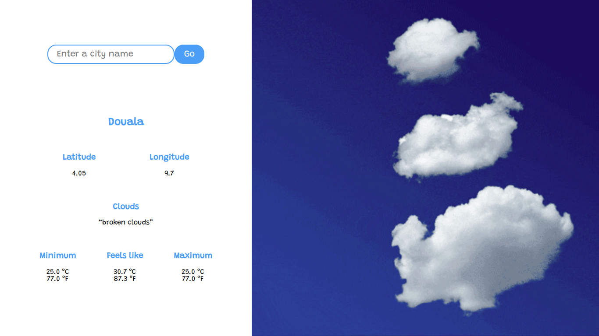

# Weather App

> This is part of the To-do-list Project in [The Odin Project's](https://www.theodinproject.com/courses/javascript/lessons/weather-app) Javascript Curriculum.

 View the app live [here](https://patriciachrysy.github.io/to-do-list/)
 
## Built With

- Javascript, HTML and CSS
- VSCode, Linters

## Getting Started

To get a local copy up and running follow these simple example steps.

- Clone the repository and there you go! ;-)

### Prerequisites

- Get a browser like Chrome and Firefox in their most recent versions

### Setup

- Clone the repository on your local machine
- cd into the folder

### Install

- Install VSCode or any code editor you like

## Authors

👤 **Manezeu Patricia Chrystelle**

- Github: [@githubhandle](https://github.com/patriciachrysy)
- Twitter: [@twitterhandle](https://twitter.com/ManezeuP)
- Linkedin: [linkedin](https://www.linkedin.com/in/manezeu-patricia-chrystelle-095072118/)

## 🤝 Contributing

Contributions, issues and feature requests are welcome!

Feel free to check the [issues page](https://github.com/patriciachrysy/to-do-list/issues).

## Show your support

Give a ⭐️ if you like this project!

